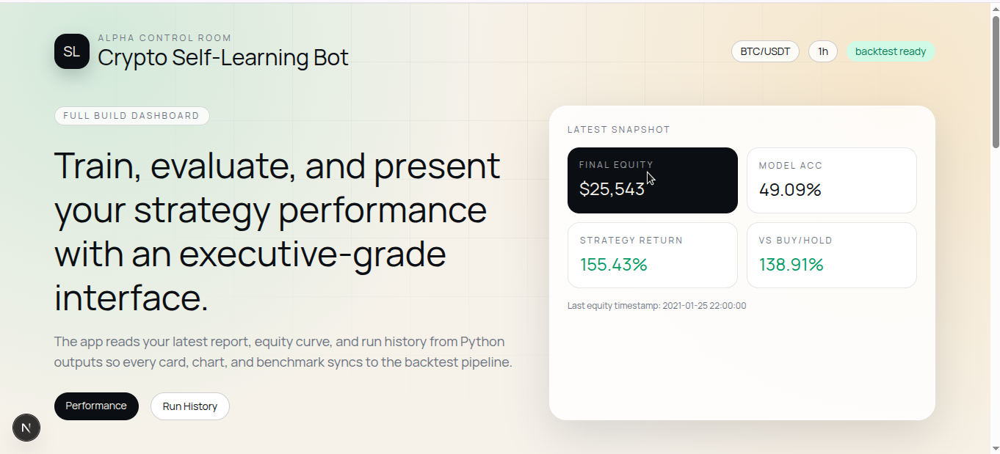

# Crypto Self-Learning Bot (Template)


A starter template for a self-learning crypto trading bot.  
Includes Python backend scripts for data ingestion, feature engineering, a simple ML model (Random Forest), a self-learning loop, backtesting utilities, sample reports, and a minimal web placeholder.

**This is a template** — you'll need to add your own API keys and tweak strategies before using with real money.

## Features
- Fetch OHLCV via CCXT (script stub)
- Compute common technical indicators (RSI, SMA, EMA)
- Train a simple supervised ML model (RandomForest) to predict short-term movement
- Simple self-learning loop that simulates trades and updates the model
- Backtesting metrics and sample JSON report
- GitHub Actions workflow for scheduled runs

## Quickstart (local)
1. Create a Python virtualenv:
```bash
python -m venv venv
source venv/bin/activate
pip install -r requirements.txt
```

2. Edit `.env` (create from `.env.example`) with your keys and config.

3. Run a backtest (sample):
```bash
python -m src.bot --symbol BTC/USDT --timeframe 1h --mode backtest
```

4. Run live (VERY RISKY — only after testing):
```bash
python -m src.bot --symbol BTC/USDT --timeframe 1h --mode paper
```

## Structure
```
crypto-self-learning-bot/
├─ src/
│  ├─ data.py
│  ├─ features.py
│  ├─ model.py
│  ├─ bot.py
├─ config/
│  └─ bot.config.json
├─ reports/
│  └─ sample-report.json
├─ web/
│  └─ README.md
├─ .github/workflows/daily-bot.yml
├─ .env.example
├─ requirements.txt
└─ README.md
```

## Notes & Warnings
- This template is educational. Do not use with real funds until thoroughly tested.
- Trading cryptocurrencies involves substantial risk.

=======
# Crypto Self-Learning Bot

A full-stack crypto strategy lab with a Python backtest engine and a production-style Next.js dashboard.



This project gives you a complete loop:
- load market data,
- engineer technical features,
- train a model,
- run a trading simulation,
- persist metrics/history,
- and visualize everything in a polished web app.

## What is included

### Backend (Python)
- Data layer for sample CSV and live exchange OHLCV via `ccxt`.
- Feature engineering pipeline (`SMA`, `EMA`, `RSI`, `MACD`, returns).
- Supervised model wrapper (`RandomForestClassifier`).
- Backtesting engine with long-only execution logic.
- Rich report generation with:
  - final equity,
  - return vs buy/hold,
  - max drawdown,
  - Sharpe,
  - Calmar,
  - trade count, win rate, exposure.
- Persistent artifacts:
  - `reports/sample-report.json` (latest run),
  - `reports/backtest-history.jsonl` (run archive),
  - `reports/latest-equity-curve.csv` (chart-ready time series),
  - `reports/model.joblib` (optional saved model).

### Frontend (Next.js)
- Executive dashboard with branded layout and motion-rich visuals.
- KPI cards, equity curve chart, market context chart, and recent run table.
- Server-side data loading from backend artifacts.
- API routes for integration:
  - `GET /api/report`
  - `GET /api/config`
  - `GET /api/history`
  - `GET /api/equity`

## Repository structure

- `src/data.py` data loading (CSV + exchange)
- `src/features.py` indicators and feature columns
- `src/model.py` ML training/inference wrapper
- `src/bot.py` CLI entrypoint and report pipeline
- `config/bot.config.json` default strategy/runtime settings
- `reports/` generated run artifacts
- `web/` Next.js dashboard

## Quickstart

### 1) Backend setup

```bash
python3 -m venv .venv
./.venv/bin/pip install -r requirements.txt
```

Run a backtest:

```bash
./.venv/bin/python -m src.bot --mode backtest --save_model
```

The command updates:
- `reports/sample-report.json`
- `reports/backtest-history.jsonl`
- `reports/latest-equity-curve.csv`
- `reports/model.joblib` (when `--save_model` is used)

### 2) Web setup

```bash
cd web
npm install
npm run dev
```

Open `http://localhost:3000`.

Production build:

```bash
npm run build
npm run start
```

## CLI options (backend)

Main command:

```bash
./.venv/bin/python -m src.bot --mode backtest [options]
```

Important options:
- `--symbol` trading pair (default `BTC/USDT`)
- `--timeframe` candle timeframe (default `1h`)
- `--initial_balance` starting capital (default `10000`)
- `--fee_rate` transaction fee per trade (default `0.001`)
- `--predict_horizon` target horizon in candles
- `--data_mode` `sample` or `exchange`
- `--data_path` custom CSV path when using sample mode
- `--exchange_name` exchange id for ccxt (default `binance`)
- `--limit` OHLCV row limit in exchange mode
- `--report_dir` artifact output directory (default `reports`)
- `--save_model` persist model to disk
- `--model_path` model output path (default `reports/model.joblib`)

## Running with live exchange candles

```bash
./.venv/bin/python -m src.bot \
  --mode backtest \
  --data_mode exchange \
  --exchange_name binance \
  --symbol BTC/USDT \
  --timeframe 1h \
  --limit 1200 \
  --save_model
```

## Report schema (latest run)

`reports/sample-report.json` contains:
- run metadata (`run_id`, `created_at_utc`, `symbol`, `timeframe`, `data_source`)
- strategy params (`predict_horizon`, `fee_rate`, `initial_balance`)
- performance (`final_equity`, `total_return_pct`, `buy_hold_return_pct`)
- risk (`max_drawdown_pct`, `annualized_sharpe`, `calmar_ratio`)
- trading stats (`closed_trades`, `wins`, `losses`, `win_rate_pct`, `exposure_pct`)
- model quality (`model_validation_accuracy`)

## Notes on methodology

- This implementation is a compact research baseline, not a live trading stack.
- It uses a simple long-only rule from classifier predictions.
- No slippage model is included yet.
- Risk controls (stops, max position, kill-switch) are not enforced at broker level.

## Safety and disclaimer

This software is for research and education. It is not investment advice. Crypto trading is high risk. Do not deploy with real capital without robust validation, controls, and monitoring.

## License

See `LICENSE`.
>>>>>>> fb80fe8 (Full app build: backend, dashboard, and professional docs)
